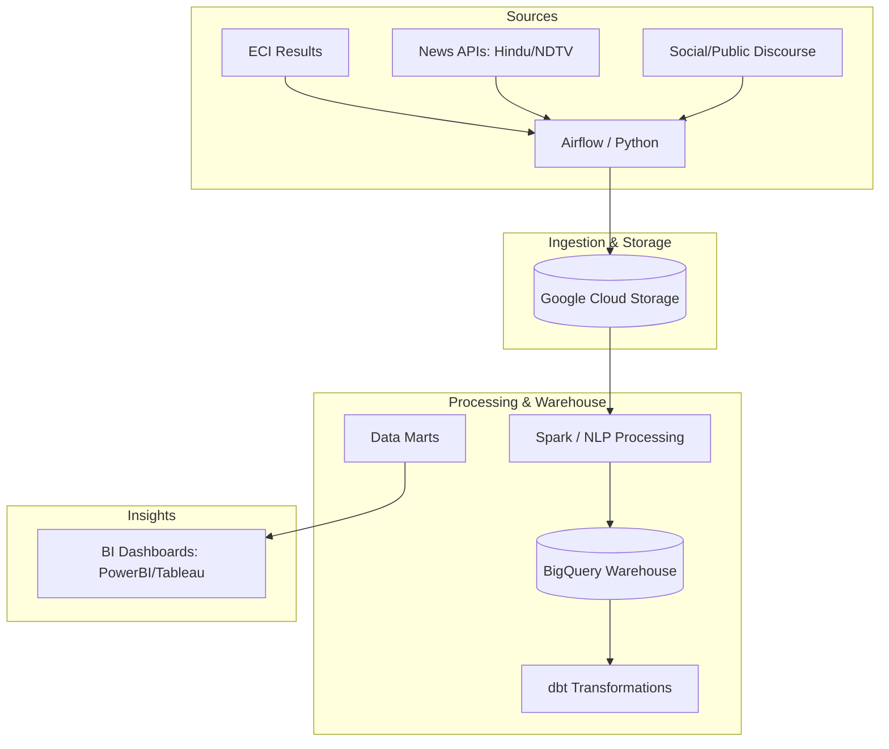

```mermaid
graph TD
    subgraph Sources
        A[ECI Results] --> AF
        B[News APIs: Hindu/NDTV] --> AF
        C[Social/Public Discourse] --> AF
    end

    subgraph "Ingestion & Storage"
        AF[Airflow / Python] --> GCS[(Google Cloud Storage)]
    end

    subgraph "Processing & Warehouse"
        GCS --> SP[Spark / NLP Processing]
        SP --> BQ[(BigQuery Warehouse)]
        BQ --> DBT[dbt Transformations]
        DM[Data Marts]
    end

    subgraph "Insights"
        DM --> BI[BI Dashboards: PowerBI/Tableau]
    end
```
